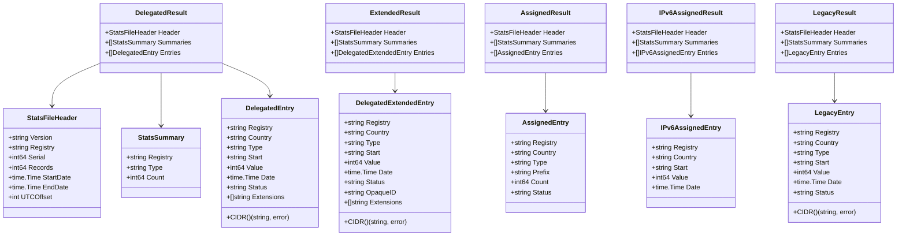
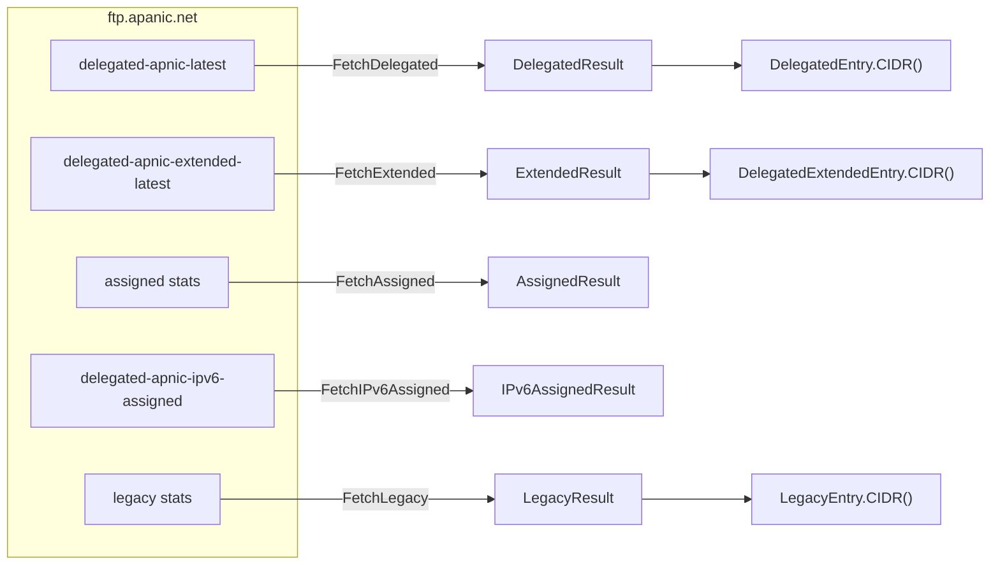

# DelegatedEntry and the Stats Family

The delegated-stats family of types models the line-oriented "registry | country | type | start | value | date | status | extensions" format that APNIC publishes for its public registry statistics. This family covers five source files — `delegated`, `extended`, `assigned`, `delegated-apnic-ipv6-assigned` and `legacy` — each with its own entry struct but a shared wrapper shape (`*Result` = header + summaries + entries).

All types below live in [`models.go`](https://github.com/cyberspacesec/apnic-skills/blob/main/models.go).

## Class Diagram



## `DelegatedEntry`

A single allocation/assignment record from the standard delegated stats file (`delegated-apnic-latest`).

| Field | Type | Description |
|-------|------|-------------|
| `Registry` | `string` | RIR identifier, always `"apnic"` for APNIC-published records. |
| `Country` | `string` | ISO 3166-1 alpha-2 economy code (e.g. `"AU"`, `"CN"`). May be empty for some records. |
| `Type` | `string` | One of `"ipv4"`, `"ipv6"`, `"asn"`. |
| `Start` | `string` | The first address (IPv4/IPv6) or ASN in the range. |
| `Value` | `int64` | Number of hosts (IPv4) or prefix length (IPv6) or count of ASNs. |
| `Date` | `time.Time` | Allocation/assignment date; zero value when the source has no date. |
| `Status` | `string` | One of `available`, `allocated`, `assigned`, `reserved`. |
| `Extensions` | `[]string` | Optional extra columns; preserved verbatim, in source order. |

## `DelegatedExtendedEntry`

A record from the extended delegated stats file (`delegated-apnic-extended-latest`). Identical to `DelegatedEntry` **plus** the `OpaqueID` field, which uniquely identifies the resource-holder organization without revealing its name.

| Field | Type | Description |
|-------|------|-------------|
| `OpaqueID` | `string` | Stable, opaque identifier for the holder organization. Use it to join against REx `/v1/holder` or transfers data. |
| (others) | | Same fields as `DelegatedEntry`. |

## `AssignedEntry`

An aggregated assignment count by prefix size from the assigned stats file. Unlike `DelegatedEntry`, each row reports a *count* of assignments of a given prefix size rather than a single range.

| Field | Type | Description |
|-------|------|-------------|
| `Prefix` | `string` | Prefix size (e.g. `"256"`, `"512"`). |
| `Count` | `int64` | Number of assignments of this prefix size. |

## `IPv6AssignedEntry`

A single IPv6 assignment record from `delegated-apnic-ipv6-assigned`. This file has a reduced column set — no status and no extensions — so the struct is correspondingly smaller.

| Field | Type | Description |
|-------|------|-------------|
| `Start` | `string` | First IPv6 address of the assignment. |
| `Value` | `int64` | IPv6 prefix length (the `N` in `/N`). |

## `LegacyEntry`

A historical (pre-RIR) resource record from the legacy stats file. Field layout matches `DelegatedEntry` minus `Extensions`.

## `*Result` wrappers

Each entry type is wrapped in a result struct that bundles the file header and per-type summaries alongside the entries:

| Wrapper | Entry type | Source |
|---------|-----------|--------|
| `DelegatedResult` | `DelegatedEntry` | `delegated-apnic-latest` |
| `ExtendedResult` | `DelegatedExtendedEntry` | `delegated-apnic-extended-latest` |
| `AssignedResult` | `AssignedEntry` | assigned stats file |
| `IPv6AssignedResult` | `IPv6AssignedEntry` | `delegated-apnic-ipv6-assigned` |
| `LegacyResult` | `LegacyEntry` | legacy stats file |

All wrappers share the same three fields:

- `Header StatsFileHeader` — version, registry, serial, record count, start/end date, UTC offset.
- `Summaries []StatsSummary` — per-type (`asn`/`ipv4`/`ipv6`) counts the file reports about itself.
- `Entries []<EntryType>` — the actual records, in file order.

## `CIDR()` method

`DelegatedEntry`, `DelegatedExtendedEntry` and `LegacyEntry` each implement:

```go
func (e <EntryType>) CIDR() (string, error)
```

The conversion depends on `Type`:

- **`ipv4`** — `Value` is the number of hosts; the prefix length is `32 - log2(Value)`. Returns `"start/prefix"` (e.g. `1.1.1.0/24`). Returns `ErrInvalidIP` if `Value` is out of range.
- **`ipv6`** — `Value` is already the prefix length; returns `"start/value"` (e.g. `2001:240::/32`). Returns `ErrInvalidIP` if `Value` is not in `[0, 128]`.
- **anything else** — returns `ErrUnsupportedType` (notably `"asn"` rows, which have no CIDR form).

This is the canonical way to turn a stats row into a routable prefix; do not compute it by hand from `Start`/`Value` because the IPv4 host-count→prefix conversion is easy to get wrong.

```go
entries, _ := client.GetDelegatedEntries(ctx)
for _, e := range entries {
    if e.Type == "ipv4" {
        if cidr, err := e.CIDR(); err == nil {
            fmt.Println(cidr) // 1.1.1.0/24
        }
    }
}
```

## Where these types are produced


