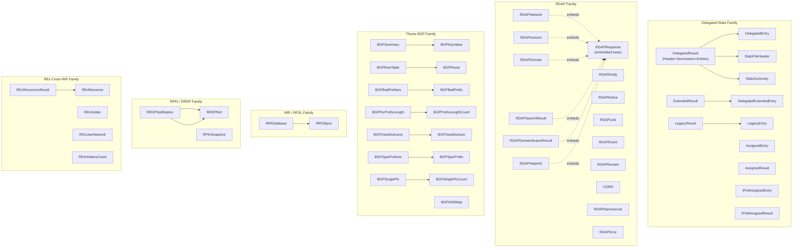

# API Types

The `apnic-skills` SDK exposes a small set of strongly-typed Go structs that mirror the data returned by each APNIC service. Every fetcher method returns one of these types (or a slice of them), so understanding the type hierarchy is the key to working with the SDK.

All types live in the root package `apnic` (file [`models.go`](https://github.com/cyberspacesec/apnic-skills/blob/main/models.go)) and are returned ready-to-use: parsing, decompression and signature verification happen inside the SDK before the result reaches the caller.

## Type Hierarchy

## Category Overview

| Category | Top-level Types | Source Service | Sub-page |
|----------|-----------------|----------------|----------|
| Delegated Stats | `DelegatedEntry`, `DelegatedExtendedEntry`, `AssignedEntry`, `IPv6AssignedEntry`, `LegacyEntry` and their `*Result` wrappers | `ftp.apnic.net` stats files | [DelegatedEntry](delegated-entry.md) |
| RDAP | `RDAPNetwork`, `RDAPAutnum`, `RDAPDomain`, `RDAPEntity`, `RDAPSearchResult` plus shared sub-structs | `rdap.apnic.net` | [RDAP Types](rdap-types.md) |
| Thyme BGP | `BGPSummary`, `BGPRawTable`, `BGPASNMap`, `BGPBadPrefixes`, `BGPPrefixLengthCount`, `BGPUsedAutnum`, `BGPSparPrefix`, `BGPSinglePfx` | `thyme.apnic.net` | [BGP Types](bgp-types.md) |
| IRR | `IRRDatabase`, `IRRObject` (19 RPSL object types) | `ftp.apnic.net` whois dumps | [IRR Types](irr-types.md) |
| RPKI / RRDP | `RRDPNotification`, `RPKISnapshot`, `RRDPRef` | RRDP repository | [RPKI Types](rpki-types.md) |
| REx | `RExResource`, `RExHolder`, `RExUserNetwork`, `RExHoldersCount` | `api.rex.apnic.net` | [REx Types](rex-types.md) |

## Conventions

- **Time handling** — every struct that carries a date uses Go `time.Time`, parsed from the APNIC source format (`YYYY-MM-DD` or RFC 3339). Callers never see raw date strings.
- **Zero values** — slices and maps are `nil` until populated; the SDK never returns a non-nil wrapper around a nil slice for "no data", it returns an empty slice where appropriate.
- **JSON tags** — RDAP and REx types carry `json` tags matching the wire format exactly; stats/BGP/IRR types are pure Go structs with no tags because their sources are pipe/whitespace-delimited text.
- **CIDR helper** — `DelegatedEntry`, `DelegatedExtendedEntry` and `LegacyEntry` each implement a `CIDR() (string, error)` method that converts the `Start`/`Value` pair into standard CIDR notation.

## Sub-pages

- [DelegatedEntry](delegated-entry.md) — Stats family: delegated, extended, assigned, IPv6-assigned, legacy.
- [RDAP Types](rdap-types.md) — Network, Autnum, Domain, Entity, Search results and shared sub-structs.
- [BGP Types](bgp-types.md) — All thyme BGP summary, route, prefix-length and SPAR structs.
- [IRR Types](irr-types.md) — `IRRDatabase` / `IRRObject` and the 19 RPSL object types.
- [RPKI Types](rpki-types.md) — RRDP notification, snapshot, ref and publish/withdraw elements.
- [REx Types](rex-types.md) — Cross-RIR resource, holder, user-network and count structs.
