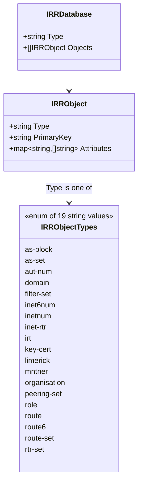
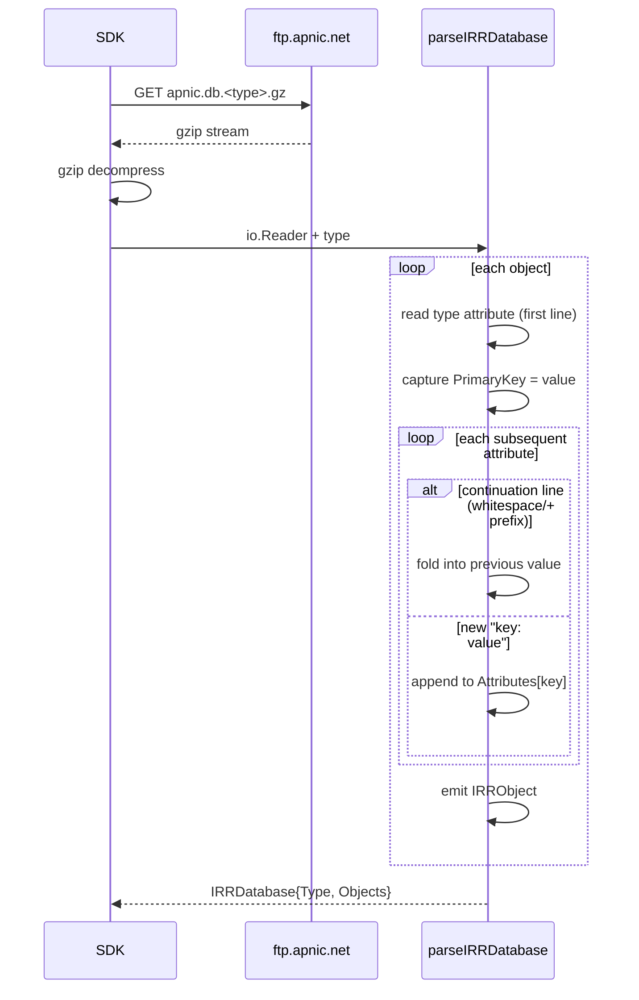

# IRR Types

The IRR (Internet Routing Registry) family models APNIC's RPSL (Routing Policy Specification Language) database dumps, published as gzipped text files at `https://ftp.apnic.net/apnic/whois/apnic.db.<type>.gz`. Each dump contains objects of a single RPSL type; the SDK parses them into a generic `IRRObject` representation rather than one struct per type.

All types live in [`models.go`](https://github.com/cyberspacesec/apnic-skills/blob/main/models.go); the canonical type list is `IRRObjectTypes` in [`irr.go`](https://github.com/cyberspacesec/apnic-skills/blob/main/irr.go).

## Class Diagram

## `IRRObject`

A single RPSL object. In the source file the first attribute of an object is its type (e.g. `inetnum:`) and its value is the object's primary key; the SDK preserves this convention.

| Field | Type | Description |
|-------|------|-------------|
| `Type` | `string` | RPSL object type, e.g. `"inetnum"`, `"aut-num"`. Always one of `IRRObjectTypes`. |
| `PrimaryKey` | `string` | Value of the type attribute — the object's unique key within the dump. |
| `Attributes` | `map[string][]string` | Attribute name → values, in file order. The key attribute is included here as well, so the type name can be looked up under `Attributes[<type>]`. Multi-valued attributes (e.g. `descr`, `mnt-by`) collect every occurrence in slice order. |

Continuation lines (lines beginning with whitespace, optionally `+`) are folded into the preceding attribute's last value, exactly as RPSL specifies.

## `IRRDatabase`

Holds the parsed objects from one dump.

| Field | Type | Description |
|-------|------|-------------|
| `Type` | `string` | The object type this database holds (echoes `IRRObject.Type` for every object). |
| `Objects` | `[]IRRObject` | Parsed RPSL objects, in file order. |

## The 19 RPSL object types

`IRRObjectTypes` lists every APNIC IRR object type published as a gzipped dump. Pass any of these to `FetchIRRDatabase` / `GetIRRDatabase`.

| Type | Purpose |
|------|---------|
| `as-block` | A block of AS numbers delegated as a unit. |
| `as-set` | A named set of AS numbers (used in routing policy). |
| `aut-num` | An Autonomous System object — routing policy of one AS. |
| `domain` | A reverse DNS domain (in-addr.arpa / ip6.arpa). |
| `filter-set` | A named set of route filters. |
| `inet6num` | An IPv6 address range. |
| `inetnum` | An IPv4 address range. |
| `inet-rtr` | An Internet router (router identity + peers). |
| `irt` | An IR trust object (CERT contact). |
| `key-cert` | A PGP key certificate. |
| `limerick` | Legacy object type (mostly historical). |
| `mntner` | A maintainer object — controls who can modify child objects. |
| `organisation` | An organization record. |
| `peering-set` | A named set of peerings. |
| `role` | A role contact (group, not a person). |
| `route` | An IPv4 route object (prefix + origin AS). |
| `route6` | An IPv6 route object. |
| `route-set` | A named set of routes. |
| `rtr-set` | A named set of routers. |

## Parse flow

