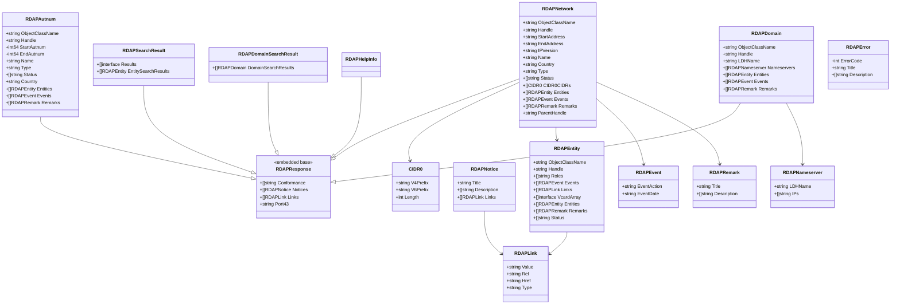
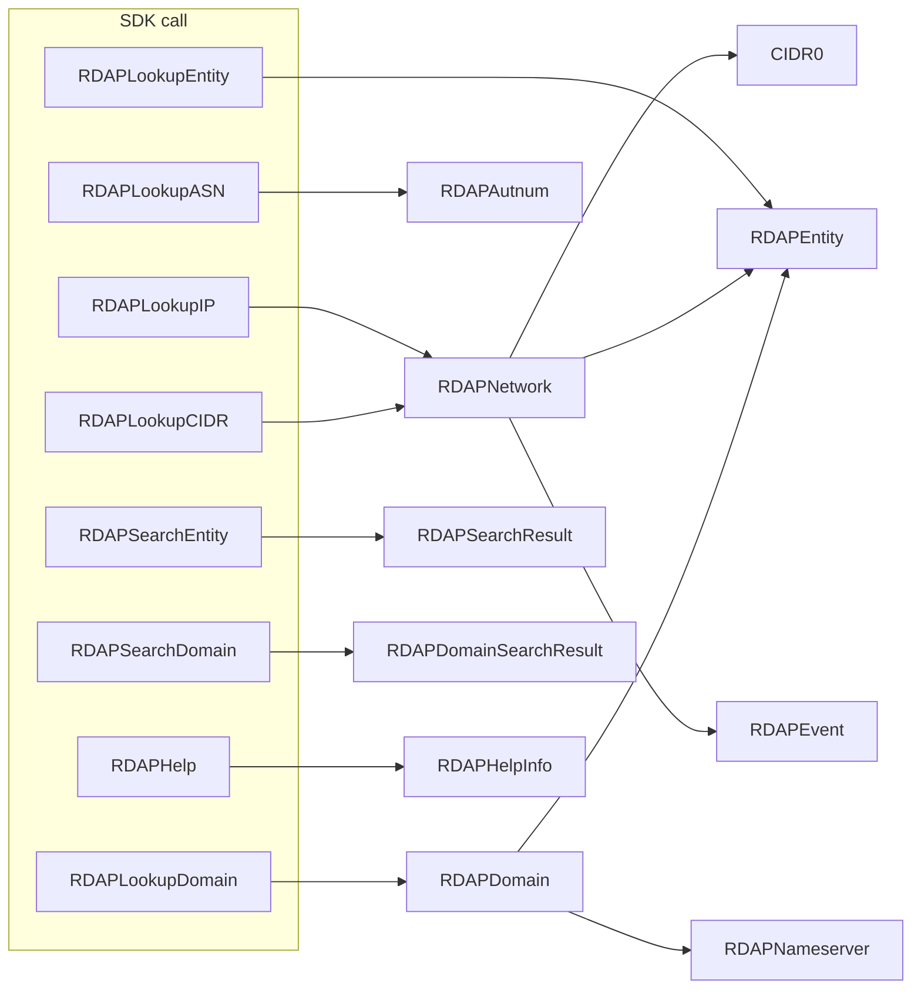

# RDAP Types

The RDAP (Registration Data Access Protocol, RFC 7483) family models JSON responses from `rdap.apnic.net`. The defining trait of this family is a shared `RDAPResponse` base struct — embedded by every top-level response type — that carries `rdapConformance`, notices, links and the `port43` whois pointer.

All types live in [`internal/models/models.go`](https://github.com/cyberspacesec/apnic-skills/blob/main/internal/models/models.go).

## Class Diagram

## `RDAPResponse` — embedded base

Every RDAP response embeds `RDAPResponse`, so the four fields below appear on every top-level type. They are optional (carried with `omitempty`) and present only when the server includes them.

| Field | JSON key | Description |
|-------|----------|-------------|
| `Conformance` | `rdapConformance` | List of RDAP conformance level strings the server claims. |
| `Notices` | `notices` | Titled notice blocks (terms-of-use, remarks). |
| `Links` | `links` | Related-resource links (self, alternate, etc.). |
| `Port43` | `port43` | The whois server hostname (`whois.apnic.net`). |

## `RDAPNetwork` — IP network object

Returned by IP and CIDR lookups (`RDAPLookupIP`, `RDAPLookupCIDR`).

| Field | JSON key | Description |
|-------|----------|-------------|
| `ObjectClassName` | `objectClassName` | Always `"ip network"`. |
| `Handle` | `handle` | Opaque resource handle. |
| `StartAddress` / `EndAddress` | `startAddress` / `endAddress` | Range endpoints as strings. |
| `IPVersion` | `ipVersion` | `"v4"` or `"v6"`. |
| `Name` | `name` | Network name (often the holder name). |
| `Country` | `country` | Economy code. |
| `Type` | `type` | Allocation type (e.g. `"allocated"`, `"assigned"`). |
| `Status` | `status` | Status list (e.g. `["active"]`). |
| `CIDR0CIDRs` | `cidr0_cidrs` | CIDR0 notation entries (see below). |
| `Entities` | `entities` | Contacts/organizations with roles. |
| `Events` | `events` | Lifecycle events (registration, last changed). |
| `ParentHandle` | `parentHandle` | Handle of the parent allocation. |

## `RDAPAutnum` — Autonomous System Number object

Returned by ASN lookups (`RDAPLookupASN`).

| Field | JSON key | Description |
|-------|----------|-------------|
| `StartAutnum` / `EndAutnum` | `startAutnum` / `endAutnum` | ASN range; for a single ASN both are equal. |
| `Name` | `name` | ASN name. |
| `Country` | `country` | Economy code. |
| `Entities` / `Events` / `Remarks` | — | Same meaning as on `RDAPNetwork`. |

## `RDAPDomain` — domain object (reverse DNS)

Returned by domain lookups (`RDAPLookupDomain`).

| Field | JSON key | Description |
|-------|----------|-------------|
| `LDHName` | `ldhName` | Letters-digits-hyphen form of the domain (e.g. `"1.0.0.10.in-addr.arpa"`). |
| `Nameservers` | `nameservers` | Authoritative nameservers. |
| `Entities` / `Events` / `Remarks` | — | Same meaning as on `RDAPNetwork`. |

## `RDAPEntity` — contact/organization

Entities are nested under `Entities` on network/autnum/domain objects, and also appear as the top-level result of `RDAPLookupEntity` and `RDAPSearchResult`. An entity may itself contain `Entities`, producing a tree.

| Field | JSON key | Description |
|-------|----------|-------------|
| `Handle` | `handle` | Entity handle (often an opaque-id). |
| `Roles` | `roles` | Roles such as `registrant`, `tech`, `abuse`, `noc`. |
| `VcardArray` | `vcardArray` | jCard contact data, kept as raw `[]interface{}` to preserve any field. |
| `Links` / `Events` / `Remarks` / `Status` | — | Standard sub-structs. |

## `RDAPSearchResult` — entity search result

Returned by `RDAPSearchEntity`. APNIC's RDAP search endpoint is `/entities` (RFC 7482 `entitySearch`); matches land in `EntitySearchResults`. The generic `Results []interface{}` field is retained for forward compatibility with future search endpoints.

| Field | JSON key | Description |
|-------|----------|-------------|
| `EntitySearchResults` | `entitySearchResults` | Matched entities. |
| `Results` | `results` | Generic results slot (currently unused by APNIC). |

## `RDAPDomainSearchResult` — domain search result

Returned by `RDAPSearchDomain` (`/domains?name=`, RFC 7482 `domainSearch`). Matching domains land in `DomainSearchResults`.

## Shared sub-structs

| Type | Used by | Purpose |
|------|---------|---------|
| `RDAPEvent` | `Events` on network/autnum/domain/entity | One lifecycle event: `EventAction` (e.g. `"registration"`) + `EventDate` string. |
| `RDAPLink` | `Links` everywhere, `Notices.Links` | Hypermedia link: `Value`, `Rel`, `Href`, `Type`. |
| `RDAPNotice` | `Notices` on `RDAPResponse` | Titled notice block with description lines and links. |
| `RDAPRemark` | `Remarks` on objects | Same shape as `RDAPNotice`, used as an inline remark. |
| `CIDR0` | `CIDR0CIDRs` on `RDAPNetwork` | One CIDR0 entry: exactly one of `V4Prefix`/`V6Prefix` plus `Length`. Use this rather than deriving from `StartAddress`/`EndAddress` when available. |
| `RDAPNameserver` | `Nameservers` on `RDAPDomain` | Nameserver `LDHName` + optional `IPs`. |
| `RDAPError` | returned on non-2xx | `ErrorCode` (HTTP status) + `Title` + `Description`. |

## Lookup flow

