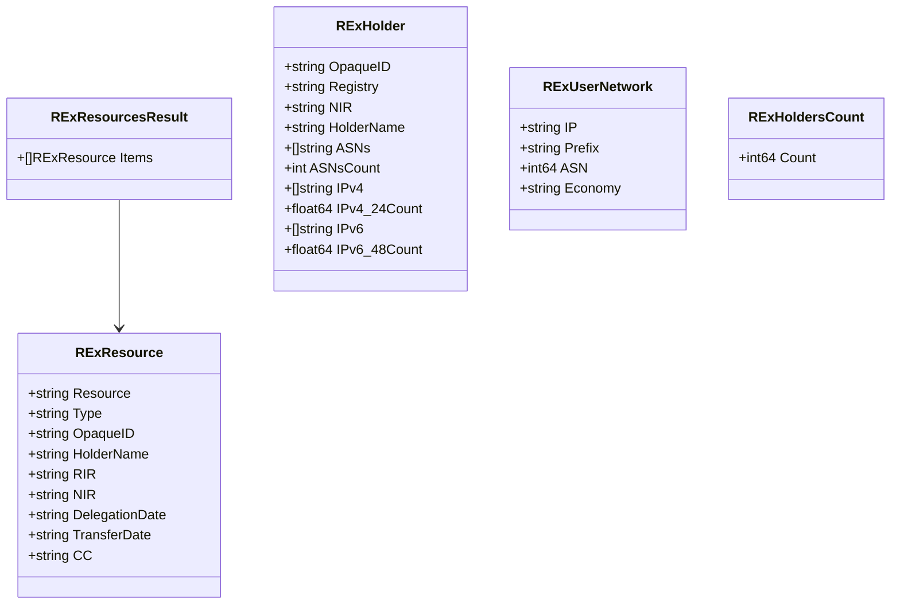
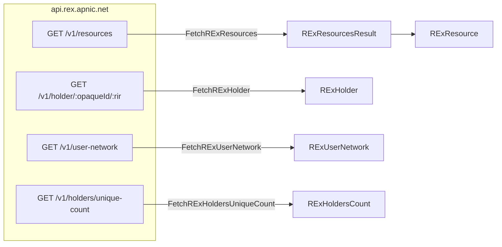

# REx Types

The REx family models responses from APNIC's REx (Resource EXplorer) cross-RIR registry API at `api.rex.apnic.net`. REx aggregates delegated resource data across all RIRs (and NIRs where applicable), exposing per-resource, per-holder, per-source-network and aggregate-count views through a small REST surface.

All types live in [`internal/models/models.go`](https://github.com/cyberspacesec/apnic-skills/blob/main/internal/models/models.go) and carry JSON tags matching the REx wire format.

## Class Diagram

## `RExResource` — `/v1/resources`

A single delegated resource record (one prefix or ASN), attributed to its holder via `OpaqueID` and tagged with the responsible RIR (and NIR where one applies). `Type` is one of `"ipv4"`, `"ipv6"`, `"asn"`.

| Field | JSON key | Description |
|-------|----------|-------------|
| `Resource` | `resource` | The prefix or ASN itself. |
| `Type` | `type` | `"ipv4"`, `"ipv6"`, or `"asn"`. |
| `OpaqueID` | `opaqueId` | Stable identifier of the holder organization; joinable against the extended delegated stats and `RExHolder.OpaqueID`. |
| `HolderName` | `holderName` | Human-readable holder name. |
| `RIR` | `rir` | Responsible Regional Internet Registry (`apnic`, `arin`, …). |
| `NIR` | `nir` | National Internet Registry, when one applies (e.g. `jpirr`, `idnic`). Empty for direct RIR delegations. |
| `DelegationDate` | `delegationDate` | Original delegation date (string, as returned by REx). |
| `TransferDate` | `transferDate` | Most recent transfer date, if any. |
| `CC` | `cc` | Economy (ISO country) code. |

## `RExResourcesResult` — wrapper

REx's `/v1/resources` returns a bounded recent window of delegated resources, newest-first — not the full history. For aggregate scale across all holders use `FetchRExHoldersUniqueCount` (→ `RExHoldersCount`).

| Field | JSON key | Description |
|-------|----------|-------------|
| `Items` | `items` | Slice of `RExResource`. |

## `RExHolder` — `/v1/holder`

The aggregated per-holder view. Given a holder's `OpaqueID` and the responsible RIR, REx returns every ASN and prefix attributed to that holder along with derived size metrics.

| Field | JSON key | Description |
|-------|----------|-------------|
| `OpaqueID` | `opaqueId` | Holder identifier; matches the input. |
| `Registry` | `registry` | RIR (`apnic`, …). |
| `NIR` | `nir` | NIR if applicable. |
| `HolderName` | `holderName` | Human-readable holder name. |
| `ASNs` / `ASNsCount` | `asns` / `asnsCount` | All ASNs held by the holder, plus the count. |
| `IPv4` / `IPv4_24Count` | `ipv4` / `ipv4_24Count` | All IPv4 prefixes, plus the holder's IPv4 space expressed in `/24` units. |
| `IPv6` / `IPv6_48Count` | `ipv6` / `ipv6_48Count` | All IPv6 prefixes, plus the holder's IPv6 space expressed in `/48` units. |

`IPv4_24Count` and `IPv6_48Count` are the standard "size" metrics used to compare holders across registries; they are `float64` because they are summed across multiple prefixes.

## `RExUserNetwork` — `/v1/user-network`

The "which network am I in?" endpoint. REx geo-locates the caller's source IP and reports the covering prefix, its origin ASN and the economy the network is registered in. It is the cross-RIR analogue of a local RDAP/whois lookup.

| Field | JSON key | Description |
|-------|----------|-------------|
| `IP` | `ip` | The source IP REx saw (after any proxy headers it trusts). |
| `Prefix` | `prefix` | The covering delegated prefix. |
| `ASN` | `asn` | Origin ASN as an integer (0 if unknown). |
| `Economy` | `economy` | ISO economy code the network is registered in. |

## `RExHoldersCount` — `/v1/holders/unique-count`

The total number of distinct resource-holder organisations across all RIRs. Use this for aggregate scale rather than summing `RExResourcesResult.Items` (which is a bounded recent window).

| Field | JSON key | Description |
|-------|----------|-------------|
| `Count` | `count` | Unique holder count across all RIRs. |

## Endpoint → type map

