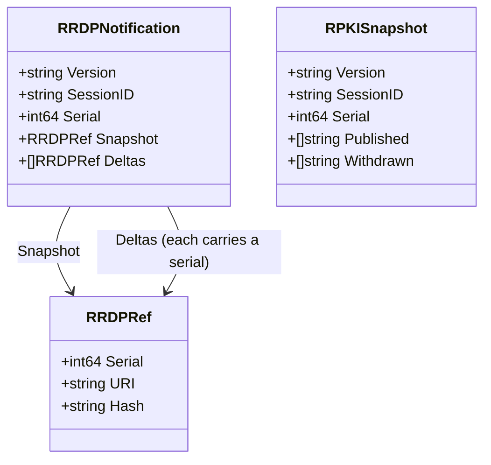
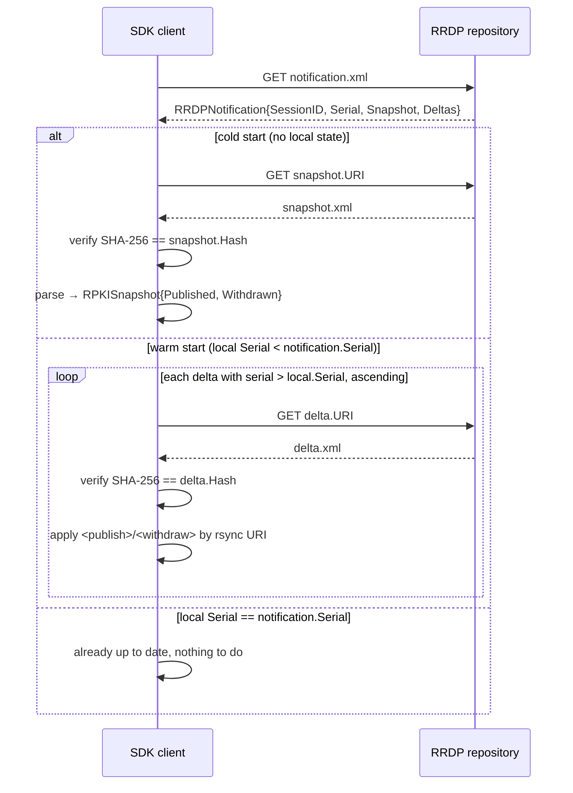

# RPKI / RRDP Types

The RPKI family models the RRDP (RPKI Repository Delta Protocol, RFC 8182) update stream published by the APNIC RPKI repository. RRDP lets a client synchronise RPKI repository state from a single notification file plus a snapshot and a series of deltas, all delivered over HTTPS and verified by SHA-256 hashes.

The SDK deliberately retains only metadata from snapshots — the rsync URIs of `<publish>` and `<withdraw>` elements — and skips the multi-megabyte base64 CMS bodies during streaming decode, to keep memory bounded.

All types live in [`internal/models/models.go`](https://github.com/cyberspacesec/apnic-skills/blob/main/internal/models/models.go).

## Class Diagram

## `RRDPNotification` — `notification.xml`

The entry point of the RRDP stream. A client reads this file first to learn the current `SessionID` and `Serial`, then decides whether to fetch the snapshot (cold start) or only the deltas it has not yet seen (warm update).

| Field | Description |
|-------|-------------|
| `Version` | RRDP protocol version (currently `"1"`). |
| `SessionID` | Stable identifier for the session; changes only when the repository is reset. The client must refuse a session change mid-stream. |
| `Serial` | Monotonically increasing serial number of the most recent state. |
| `Snapshot` | A `RRDPRef` pointing at the snapshot file describing the full current state. |
| `Deltas` | Ordered list of `RRDPRef` deltas; each carries its own serial, URI and hash. |

## `RRDPRef` — snapshot/delta reference

A reference to one RRDP file (snapshot or delta). For snapshots the `Serial` is the serial the snapshot brings the client to; for deltas it is the serial that delta advances *from* to the next.

| Field | Description |
|-------|-------------|
| `Serial` | Serial number associated with the file. |
| `URI` | HTTPS URL of the snapshot/delta XML. |
| `Hash` | Expected SHA-256 of the file; the client verifies the downloaded bytes against this. |

## `RPKISnapshot` — `snapshot.xml`

The full current state of the repository as a list of `<publish>` and `<withdraw>` elements. Each `<publish>` element carries a `uri` attribute (an rsync URI) and a base64-encoded CMS object body.

To keep memory bounded for multi-megabyte snapshots, the SDK streams the XML and retains only the rsync URIs — the base64 CMS bodies are skipped during decode.

| Field | Description |
|-------|-------------|
| `Version` / `SessionID` / `Serial` | Mirror the notification fields; the snapshot must match the session referenced by the notification. |
| `Published` | rsync URIs of `<publish>` elements, in file order. |
| `Withdrawn` | rsync URIs of `<withdraw>` elements, in file order. |

## Publish / Withdraw elements

RRDP distinguishes two element kinds inside snapshots and deltas:

- **`<publish>`** — a new or updated RPKI object. Identified by its rsync `uri` attribute and accompanied by a base64 CMS body. The SDK records only the URI.
- **`<withdraw>`** — an object to be removed. Identified by its rsync `uri` attribute only; no body. The SDK records only the URI.

Deltas contain a mix of publish and withdraw elements relative to the previous serial; snapshots contain only publish elements (a snapshot is the complete current set).

## Synchronisation flow

