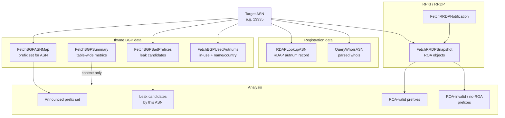
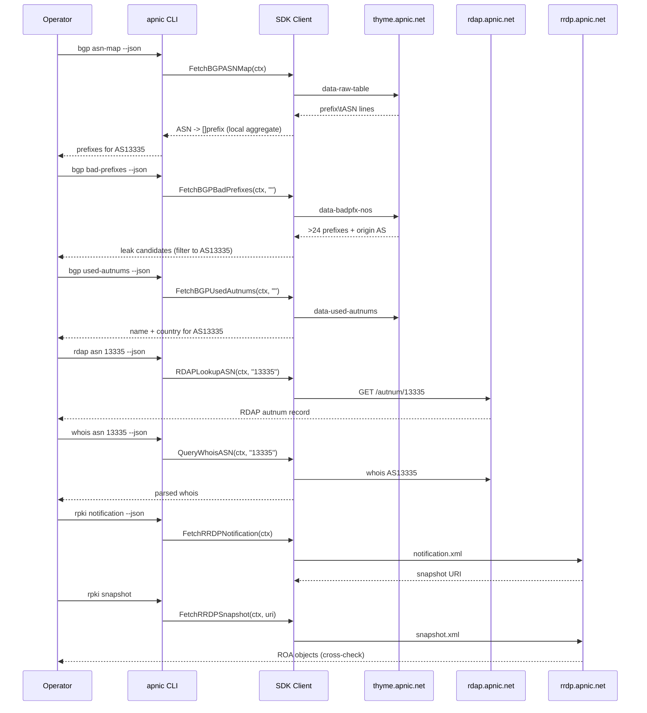

# ASN Analysis

## Scenario

An operator wants a full profile of one Autonomous System (e.g. `AS13335`): every prefix it announces on the BGP table, whether any of those prefixes are route-leak candidates (more-specifics longer than /24), whether the ASN is actually in use and who registered it, and whether its announcements agree with its IRR/RDAP registration. This surfaces hijacks, leaks, and stale registrations.

## Composition

| Layer | Method / Command | Purpose |
|-------|------------------|---------|
| Prefix set | `FetchBGPASNMap` / `apnic bgp asn-map` | All prefixes originated by the ASN (local aggregation of the raw table). |
| Raw routes | `FetchBGPRawTable` / `apnic bgp raw-table` | The underlying `prefix\tASN` lines, for exact matching. |
| Leak candidates | `FetchBGPBadPrefixes(ctx, source)` / `apnic bgp bad-prefixes` | Prefixes longer than /24 + origin AS — likely leaks. |
| In-use status | `FetchBGPUsedAutnums(ctx, source)` / `apnic bgp used-autnums` | Confirms the ASN is announced; gives registered name + country. |
| Summary metrics | `FetchBGPSummary` / `apnic bgp summary` | Table-wide counts (entries, AS count, ROA coverage). |
| Registration | `RDAPLookupASN(ctx, asn)` / `apnic rdap asn` | RDAP record for the ASN. |
| Whois | `QueryWhoisASN(ctx, asn)` / `apnic whois asn` | Parsed whois for the ASN. |
| RPKI cross-check | `FetchRRDPNotification` + `FetchRRDPSnapshot` / `apnic rpki ...` | ROAs authorizing the ASN's prefixes (valid/invalid). |



## Flow: analysis sequence



## Go example

```go
package main

import (
    "context"
    "fmt"
    "log"
    "strings"

    apnic "github.com/cyberspacesec/apnic-skills"
)

// ASNReport summarizes one ASN's routing and registration state.
type ASNReport struct {
    ASN         string
    Name        string
    Country     string
    Prefixes    []string
    LeakCandidates []string
    RDAPHandle  string
    RDAPCountry string
}

// AnalyzeASN builds the report for one AS number.
func AnalyzeASN(ctx context.Context, client *apnic.Client, asn string) (*ASNReport, error) {
    r := &ASNReport{ASN: asn}

    // 1. Prefix set: aggregate the raw table by origin ASN.
    asMap, err := client.FetchBGPASNMap(ctx)
    if err != nil {
        return nil, fmt.Errorf("bgp asn-map: %w", err)
    }
    if pfxs, ok := asMap.ASNs["AS"+asn]; ok {
        r.Prefixes = pfxs
    } else if pfxs, ok := asMap.ASNs[asn]; ok {
        r.Prefixes = pfxs
    }

    // 2. Leak candidates: prefixes longer than /24 originated by this ASN.
    bad, err := client.FetchBGPBadPrefixes(ctx, "")
    if err == nil {
        for _, p := range bad.Prefixes {
            if normalizeASN(p.OriginAS) == asn {
                r.LeakCandidates = append(r.LeakCandidates, p.Address)
            }
        }
    }

    // 3. In-use status + registered name/country.
    used, err := client.FetchBGPUsedAutnums(ctx, "")
    if err == nil {
        for _, u := range used.Autnums {
            if normalizeASN(u.ASN) == asn {
                r.Name = u.Name
                r.Country = u.Country
                break
            }
        }
    }

    // 4. RDAP registration.
    if rd, err := client.RDAPLookupASN(ctx, asn); err == nil {
        r.RDAPHandle = rd.Handle
        r.RDAPCountry = rd.Country
    }

    // 5. Optional: whois detail.
    // if wr, err := client.QueryWhoisASN(ctx, asn); err == nil { ... }

    // 6. Optional: RPKI cross-check via RRDP snapshot.
    // notif, _ := client.FetchRRDPNotification(ctx)
    // client.FetchRRDPSnapshot(ctx, notif.Snapshot.URI)  // stream ROAs

    return r, nil
}

func normalizeASN(s string) string {
    return strings.TrimPrefix(strings.TrimSpace(s), "AS")
}

func main() {
    client := apnic.NewClient()
    ctx := context.Background()
    rep, err := AnalyzeASN(ctx, client, "13335")
    if err != nil {
        log.Fatal(err)
    }
    fmt.Printf("AS%s (%s, %s): %d prefixes, %d leak candidates, RDAP handle=%s\n",
        rep.ASN, rep.Name, rep.Country, len(rep.Prefixes),
        len(rep.LeakCandidates), rep.RDAPHandle)
}
```

## CLI combination

```bash
ASN=13335

# 1) Prefix set originated by AS13335
apnic --json bgp asn-map | jq -r --arg asn "AS$ASN" '.ASNs[$asn][]'

# 2) Total prefix count for the ASN
apnic --json bgp asn-map | jq --arg asn "AS$ASN" '.ASNs[$asn] | length'

# 3) Leak candidates (prefixes > /24) originated by this ASN
apnic --json bgp bad-prefixes \
  | jq -r --arg asn "$ASN" '.Prefixes[] | select(.OriginAS | endswith($ASN)) | .Address'

# 4) In-use status + registered name + country
apnic --json bgp used-autnums | jq -r --arg asn "$ASN" '.Autnums[] | select(.ASN==$asn)'

# 5) RDAP autnum record
apnic rdap asn "$ASN" --json

# 6) Parsed whois
apnic whois asn "$ASN" --json

# 7) Table-wide context (ROA coverage, entry count)
apnic --json bgp summary | jq '.Entries[] | select(.Key | test("ROA|entries|AS count"))'

# 8) RPKI cross-check: ROAs authorizing AS13335
apnic rpki notification --json | jq '{session: .SessionID, serial: .Serial, snapshot: .Snapshot.URI}'
apnic rpki snapshot   # stream current ROA objects
```

### Variant: compare collectors

The derived analyses accept `--bgp-source`. Compare the global view with the Brisbane and Hong Kong collectors to spot regional differences in what the ASN announces:

```bash
for src in current au hk; do
  n=$(apnic --json bgp asn-map --bgp-source "$src" 2>/dev/null \
       | jq --arg asn "AS$ASN" '.ASNs[$asn] | length')
  echo "$src: $n prefixes"
done
```

> `asn-map`, `summary`, and `raw-table` are sourced from the `current` raw files; `--bgp-source` applies to the per-source derived files (`bad-prefixes`, `used-autnums`, `per-prefix-length`, `spar-prefixes`, `single-pfx`).

## One-shot script

```bash
#!/usr/bin/env bash
# asn-report.sh — prefix count, leak candidates, and registration for one ASN.
set -euo pipefail
ASN="${1:?usage: $0 <asn>}"

echo "== AS$ASN announced prefixes =="
apnic --json bgp asn-map | jq -r --arg asn "AS$ASN" '.ASNs[$asn][]' | sort

echo "== leak candidates (> /24) =="
apnic --json bgp bad-prefixes \
  | jq -r --arg asn "$ASN" '.Prefixes[] | select(.OriginAS | endswith($ASN)) | .Address'

echo "== in-use / name / country =="
apnic --json bgp used-autnums | jq -r --arg asn "$ASN" '.Autnums[] | select(.ASN==$asn)'

echo "== RDAP =="
apnic rdap asn "$ASN" --json | jq '{handle, country, name: .name}'
```

## Expected output

- **Prefix set:** one CIDR per line, e.g. `1.1.1.0/24`.
- **Leak candidates:** addresses longer than /24 attributed to the ASN; an empty result means the ASN announces no leak-suspect prefixes.
- **used-autnums:** `ASN<Tab>Name<Tab>FullName<Tab>Country`, confirming the ASN is in use and naming its registrant.
- **RDAP:** `handle` (the autnum handle), `country`, entity handles, and registration/last-changed events.

## Notes

- `FetchBGPASNMap` is a local aggregation over the raw table — it makes no extra request beyond fetching `data-raw-table`. The map keys include the `AS` prefix (e.g. `AS13335`); normalize when matching.
- `FetchBGPBadPrefixes` lists every > /24 prefix globally; filter client-side by origin AS. A non-empty leak list is a starting point for investigation, not proof of malice — some networks legitimately deaggregate.
- Cross-checking against RPKI (`rpki snapshot`) tells you which of the ASN's prefixes have valid ROAs; prefixes announced without a matching ROA are RPKI-invalid or uncovered.
- For ASNs announcing fewer than 20 prefixes, `bgp single-pfx` gives the RIR-grouped count of such small announcers — useful context when investigating a suspicious small ASN.
