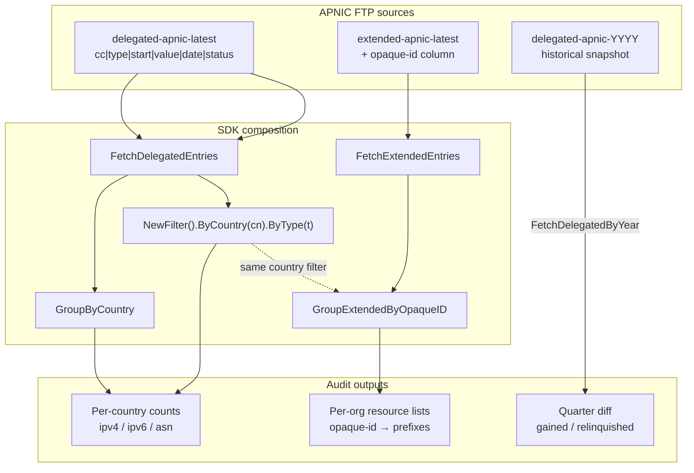
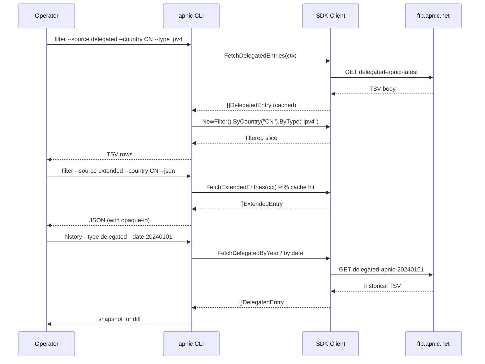

# Country Resource Audit

## Scenario

A regulator, a national CERT, or a network operator needs to inventory everything a country (e.g. `CN`, `JP`, `AU`) holds in APNIC: every allocated and assigned IPv4 prefix, every IPv6 prefix, every ASN, plus the organization behind each allocation. The deliverable is a per-country, per-organization breakdown that can be diffed against last quarter's snapshot.

## Composition

| Layer | Method / Command | Purpose |
|-------|------------------|---------|
| Inventory | `FetchDelegatedEntries` / `apnic filter --source delegated` | The RIR statistics exchange file: every `cc|type|start|value|date|status` record. |
| Filter | `NewFilter(entries).ByCountry(cn).ByType(ipv4)` | Restrict to one country and one resource type. |
| Group | `GroupByCountry(entries)` | Roll up counts per economy code. |
| Holder attribution | `FetchExtendedEntries` / `apnic filter --source extended` | The extended file carries the `opaque-id` column that identifies the holding organization. |
| Holder grouping | `GroupExtendedByOpaqueID(extEntries)` | Bucket all of an org's resources under one opaque-id. |
| Diff | `FetchDelegatedByYear(ctx, year)` / `apnic history` | A historical snapshot to compare against today. |



## Flow: end-to-end audit



## Go example

```go
package main

import (
    "context"
    "fmt"
    "log"

    apnic "github.com/cyberspacesec/apnic-skills"
)

// CountryAudit returns a per-country, per-organization resource inventory.
func CountryAudit(ctx context.Context, client *apnic.Client, cc string) error {
    // 1. Inventory from the standard delegated stats.
    entries, err := client.FetchDelegatedEntries(ctx)
    if err != nil {
        return fmt.Errorf("fetch delegated: %w", err)
    }

    // 2. Filter to one country, all three resource types.
    for _, t := range []string{"ipv4", "ipv6", "asn"} {
        rows := apnic.NewFilter(entries).ByCountry(cc).ByType(t).Result()
        fmt.Printf("%s %s: %d records\n", cc, t, len(rows))
    }

    // 3. Roll up counts per country (sanity check against the filter).
    byCountry := apnic.GroupByCountry(entries)
    fmt.Printf("%s grouped count: %d\n", cc, len(byCountry[cc]))

    // 4. Holder attribution from the extended stats (opaque-id column).
    ext, err := client.FetchExtendedEntries(ctx)
    if err != nil {
        return fmt.Errorf("fetch extended: %w", err)
    }
    extCN := apnic.NewExtendedFilter(ext).ByCountry(cc).Result()

    // 5. Group extended records by organization opaque-id.
    byOrg := apnic.GroupExtendedByOpaqueID(extCN)
    for opaqueID, orgRes := range byOrg {
        fmt.Printf("  org %s: %d allocations\n", opaqueID, len(orgRes))
    }

    // 6. Optional: diff against a historical snapshot.
    // historical, err := client.FetchDelegatedByYear(ctx, "2024")
    // if err != nil { return err }
    // ...compare entries vs historical by (type, start, value) key...

    return nil
}

func main() {
    client := apnic.NewClient()
    ctx := context.Background()
    if err := CountryAudit(ctx, client, "CN"); err != nil {
        log.Fatal(err)
    }
}
```

## CLI combination

```bash
CC=CN

# 1) CN IPv4 allocations (allocated + assigned)
apnic filter --source delegated --country "$CC" --type ipv4

# 2) CN IPv6 allocations
apnic filter --source delegated --country "$CC" --type ipv6

# 3) CN ASN holdings
apnic filter --source delegated --country "$CC" --type asn

# 4) Per-country roll-up (counts across all types)
apnic delegated --json | jq -r '.Entries | group_by(.CC)[] | "\(.[0].CC)\t\(length)"' | sort -k2 -rn

# 5) Holder attribution: list each opaque-id and its resources
apnic filter --source extended --country "$CC" --json \
  | jq -r '.Entries[] | "\(.OpaqueID)\t\(.Type)\t\(.Start)"' \
  | sort -u
```

### Variant: only allocated-but-not-announced

```bash
apnic filter --source delegated --country "$CC" --type ipv4 --status allocated
```

### Variant: audit one organization by opaque-id

```bash
apnic filter --source extended --opaque-id A92E1062 --json
```

### Variant: quarter-over-quarter diff

```bash
# Today's CN IPv4 starts
apnic filter --source delegated --country CN --type ipv4 --json \
  | jq -r '.Entries[].Start' | sort > /tmp/cn-now.txt

# 2024-01-01 CN IPv4 starts
apnic history --type delegated --date 20240101 --json \
  | jq -r --arg cc "CN" '.Entries[] | select(.CC==$cc and .Type=="ipv4") | .Start' | sort > /tmp/cn-old.txt

# Gained (in now, not in old)
comm -13 /tmp/cn-old.txt /tmp/cn-now.txt
# Relinquished (in old, not in now)
comm -23 /tmp/cn-old.txt /tmp/cn-now.txt
```

## One-shot script

```bash
#!/usr/bin/env bash
# cn-audit.sh — emit a per-type count + per-org opaque-id summary for a country.
set -euo pipefail
CC="${1:?usage: $0 <CC>}"

echo "== $CC delegated counts =="
for t in ipv4 ipv6 asn; do
  n=$(apnic filter --source delegated --country "$CC" --type "$t" --json | jq '.Entries | length')
  echo "$CC $t: $n records"
done

echo "== $CC organizations (opaque-id → allocation count) =="
apnic filter --source extended --country "$CC" --json \
  | jq -r '.Entries[] | .OpaqueID' \
  | sort | uniq -c | sort -rn
```

## Expected output

- **Steps 1–3:** TSV rows `CN<Tab>ipv4<Tab><start><Tab><value><Tab><status><Tab><date>`.
- **Step 5:** `opaque-id<Tab>type<Tab>start` lines, one per allocation; pipe through `sort -u` to deduplicate.
- **Script:** a count line per type, then an opaque-id histogram sorted by allocation count.

## Notes

- The extended file's `opaque-id` is the key that links a delegation record to an organization; it is **absent** from the standard delegated file. Use extended for holder attribution, standard for raw counts.
- `GroupExtendedByOpaqueID` is an in-memory operation over the already-fetched extended slice — no extra network request.
- The 30-minute cache means steps 1–5 in the script hit the network for `delegated` and `extended` exactly once each.
- For a multi-country audit, fetch once and filter in-process (Go) rather than re-running the CLI per country.
