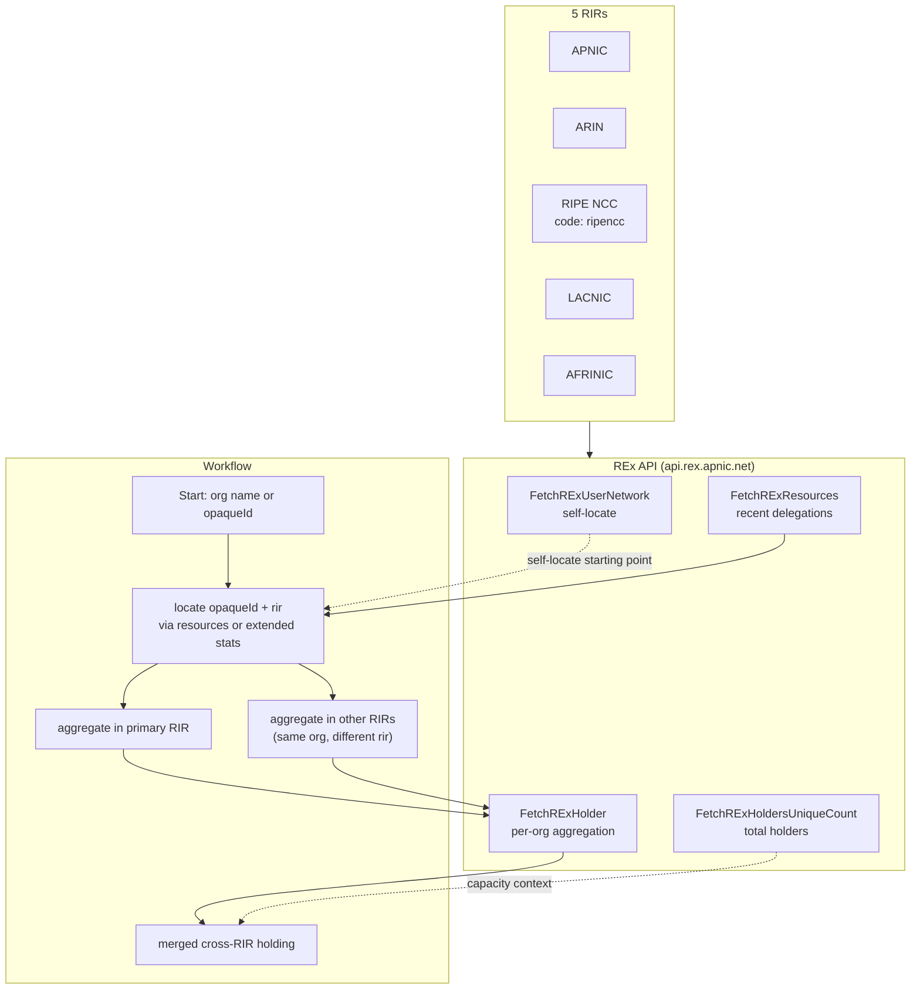
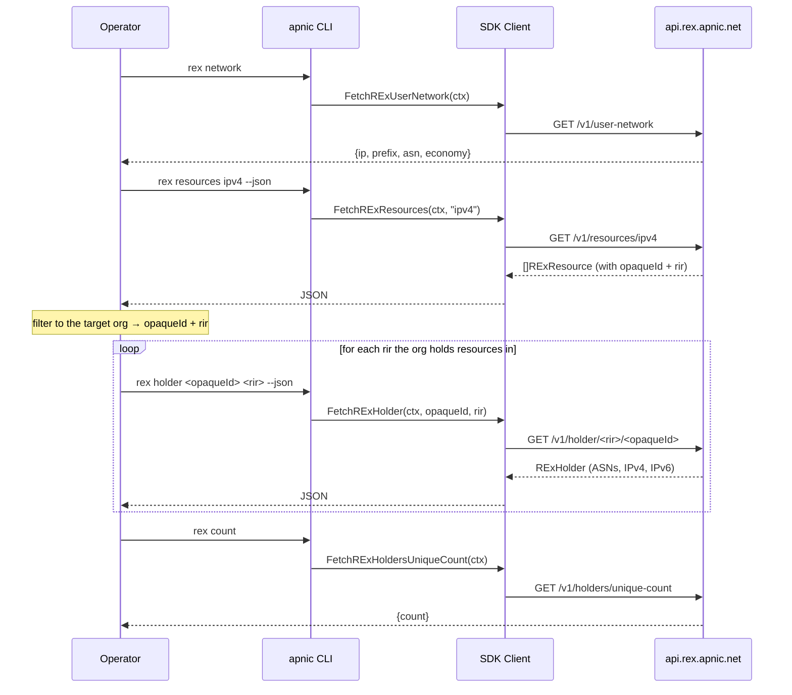

# Cross-RIR Lookup

## Scenario

APNIC's RDAP and delegated stats only cover the APNIC region. But a single organization often holds resources across multiple RIRs — a multinational with allocations in APNIC, ARIN, and RIPE NCC, for example. REx (Resource EXplorer, `api.rex.apnic.net`) aggregates delegated data from all five RIRs (AFRINIC, APNIC, ARIN, LACNIC, RIPE NCC) into one view, attributed to each holder via `opaqueId`. The workflow: locate the target organization's `opaqueId` and responsible `rir`, then aggregate every ASN and prefix it holds across all RIRs.

## Composition

| Layer | Method / Command | Purpose |
|-------|------------------|---------|
| Self-locate | `FetchRExUserNetwork(ctx)` / `apnic rex network` | The caller's covering prefix, ASN, economy — useful as a starting opaqueId. |
| Find the org | `FetchRExResources(ctx, type)` / `apnic rex resources` | Cross-RIR recent delegations with holder attribution; locate the target `opaqueId` + `rir`. |
| Aggregate | `FetchRExHolder(ctx, opaqueID, rir)` / `apnic rex holder` | All ASNs + IPv4 + IPv6 prefixes held by one organization in one RIR. |
| Scale | `FetchRExHoldersUniqueCount(ctx)` / `apnic rex count` | Total unique holder count across all RIRs (context / capacity). |
| Seed opaqueId | `FetchExtendedEntries` / `apnic filter --source extended` | APNIC-side `opaque-id` to feed into `rex holder` when `rir=apnic`. |



## Flow: cross-RIR aggregation



## Go example

```go
package main

import (
    "context"
    "fmt"
    "log"

    apnic "github.com/cyberspacesec/apnic-skills"
)

// OrgHolding is one organization's resources in one RIR.
type OrgHolding struct {
    OpaqueID string
    RIR      string
    Name     string
    ASNs     []string
    IPv4     []string
    IPv6     []string
}

// CrossRIRHolding aggregates one organization's resources across every RIR
// where it holds resources.
func CrossRIRHolding(ctx context.Context, client *apnic.Client, targetOrg string) ([]OrgHolding, error) {
    // 1. Pull recent cross-RIR delegations with holder attribution.
    res, err := client.FetchRExResources(ctx, "") // "" = all types
    if err != nil {
        return nil, fmt.Errorf("rex resources: %w", err)
    }

    // 2. Locate the target org's (opaqueId, rir) pairs.
    seen := map[string]bool // "opaqueId|rir"
    var pairs []struct{ opaqueID, rir, name string }
    for _, r := range res.Items {
        if r.HolderName == targetOrg {
            key := r.OpaqueID + "|" + r.RIR
            if !seen[key] {
                seen[key] = true
                pairs = append(pairs, struct{ opaqueID, rir, name string }{
                    r.OpaqueID, r.RIR, r.HolderName,
                })
            }
        }
    }
    if len(pairs) == 0 {
        return nil, fmt.Errorf("org %q not found in recent REx resources", targetOrg)
    }

    // 3. Aggregate in each RIR where the org appears.
    var holdings []OrgHolding
    for _, p := range pairs {
        h, err := client.FetchRExHolder(ctx, p.opaqueID, p.rir)
        if err != nil {
            return nil, fmt.Errorf("rex holder %s/%s: %w", p.rir, p.opaqueID, err)
        }
        holdings = append(holdings, OrgHolding{
            OpaqueID: h.OpaqueID,
            RIR:      h.Registry,
            Name:     h.HolderName,
            ASNs:     h.ASNs,
            IPv4:     h.IPv4,
            IPv6:     h.IPv6,
        })
    }
    return holdings, nil
}

func main() {
    client := apnic.NewClient()
    ctx := context.Background()

    // Capacity context: how many unique holders exist across all RIRs.
    if cnt, err := client.FetchRExHoldersUniqueCount(ctx); err == nil {
        fmt.Printf("total unique holders (all RIRs): %d\n", cnt.Count)
    }

    holdings, err := CrossRIRHolding(ctx, client, "Cloudflare, Inc.")
    if err != nil {
        log.Fatal(err)
    }
    for _, h := range holdings {
        fmt.Printf("%s [%s]: %d ASNs, %d IPv4 prefixes, %d IPv6 prefixes\n",
            h.Name, h.RIR, len(h.ASNs), len(h.IPv4), len(h.IPv6))
    }
}
```

## CLI combination

```bash
# 1) Self-locate the caller's covering network (prefix/ASN/economy)
apnic rex network

# 2) Recent cross-RIR delegations with holder attribution (ipv4/ipv6/asn or empty)
apnic rex resources ipv4 --json
apnic rex resources ipv6 --json
apnic rex resources asn  --json

# 3) Total unique holder count across all RIRs (capacity / context)
apnic rex count

# 4) Aggregate one org's resources in one RIR
#    apnic rex holder <opaqueId> <rir> --json
apnic rex holder A92E1062 apnic --json
```

### Variant: seed the opaqueId from APNIC extended stats

When you already know the org is an APNIC holder, get its `opaque-id` locally, then ask REx to aggregate it:

```bash
# Find the opaque-id for an org from APNIC extended stats
apnic filter --source extended --json \
  | jq -r '.Entries[] | select(.OpaqueID) | "\(.OpaqueID)\t\(.Start)"' \
  | sort -u

# Then aggregate that opaqueId in the apnic RIR via REx
apnic rex holder <opaqueId> apnic --json
```

### Variant: enumerate an org across every RIR

```bash
ORG="Cloudflare, Inc."
# Collect distinct (opaqueId, rir) pairs for the org from cross-RIR resources
apnic rex resources --json \
  | jq -r --arg org "$ORG" '
      .Items[]
      | select(.holderName == $org)
      | "\(.opaqueId)\t\(.rir)"
    ' | sort -u \
  | while IFS=$'\t' read -r oid rir; do
      echo "== $oid ($rir) =="
      apnic rex holder "$oid" "$rir" --json \
        | jq '{name: .holderName, asns: (.asns|length), ipv4: (.ipv4|length), ipv6: (.ipv6|length)}'
    done
```

## One-shot script: per-RIR holding summary

```bash
#!/usr/bin/env bash
# org-cross-rir.sh — print one org's holding counts per RIR.
set -euo pipefail
ORG="${1:?usage: $0 <org name>}"

apnic rex resources --json \
  | jq -r --arg org "$ORG" '.Items[] | select(.holderName == $org) | "\(.opaqueId)\t\(.rir)"' \
  | sort -u \
  | while IFS=$'\t' read -r oid rir; do
      apnic rex holder "$oid" "$rir" --json \
        | jq -r --arg rir "$rir" --arg oid "$oid" \
            '"\($rir)\t\($oid)\tASNs=\(.asns|length)\tipv4=\(.ipv4|length)\tipv6=\(.ipv6|length)"'
    done
```

## Expected output

- **`rex network`:** `{ip, prefix, asn, economy}` — the caller's covering network.
- **`rex resources`:** an array of `RExResource` with `resource`, `type`, `opaqueId`, `holderName`, `rir`, `nir`, `delegationDate`, `transferDate`, `cc`.
- **`rex holder`:** an `RExHolder` with `opaqueId`, `registry`, `holderName`, the full `asns`/`ipv4`/`ipv6` lists, and the `*Count` summary fields (`asnsCount`, `ipv4_24Count`, `ipv6_48Count`).
- **`rex count`:** `{count: <int64>}` — total unique holders across all five RIRs.

## Notes

- The `rir` parameter for `FetchRExHolder` must be one of `afrinic`, `apnic`, `arin`, `lacnic`, `ripencc`. The RIPE NCC code is **`ripencc`**, not `ripe`.
- A single organization can hold resources in more than one RIR; iterate over every distinct `(opaqueId, rir)` pair returned by `rex resources` to get the full cross-RIR picture.
- `FetchRExResources` returns **recent** delegations. To find an org that holds no recently-delegated resource, seed its `opaqueId` from APNIC extended stats (`FilterExtendedByOpaqueID`) and call `FetchRExHolder` directly.
- REx is a public HTTPS REST API and shares the SDK's unified HTTP client, so it inherits the stealth headers, rate limit, and jitter.
- For an APNIC-only single-org audit, the [Country Resource Audit](country-audit.md) workflow is lighter weight; reach for REx only when you need the cross-RIR view.
