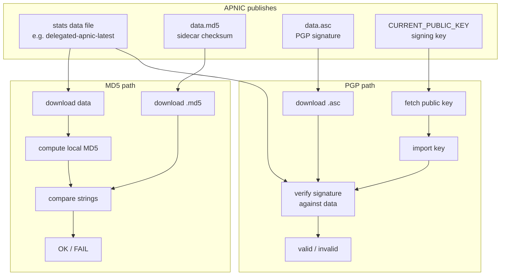
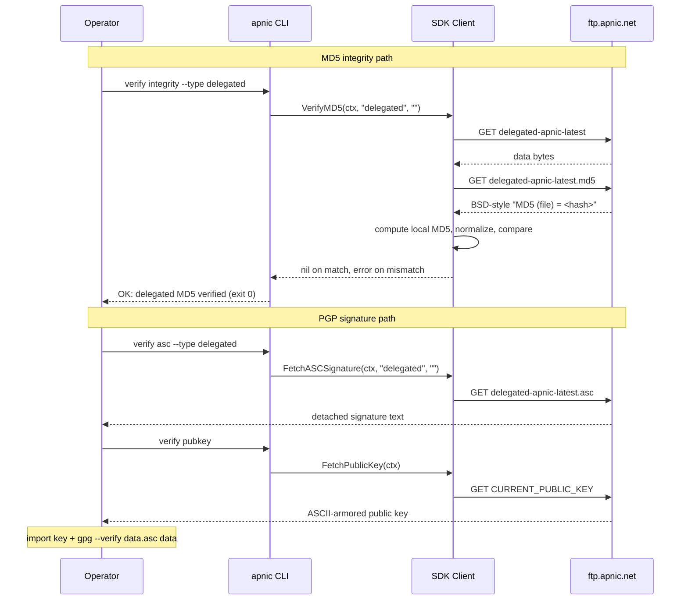

# Data Integrity

## Scenario

You downloaded an APNIC stats file (delegated, extended, assigned, IPv6-assigned, or legacy) — possibly from a mirror, possibly a cached archive. Before trusting it, you must prove it is authentic and unmodified: the local MD5 must match APNIC's published `.md5` sidecar, and the PGP signature (`.asc`) must verify against APNIC's published signing public key. This is the trust root for every downstream workflow.

## Composition

| Layer | Method / Command | Purpose |
|-------|------------------|---------|
| End-to-end MD5 | `VerifyMD5(ctx, dataType, date)` / `apnic verify integrity` | Download the data file + `.md5` sidecar, compute locally, compare. |
| Raw MD5 | `FetchMD5Checksum(ctx, dataType, date)` / `apnic verify md5` | The published checksum string (BSD- and GNU-compatible). |
| PGP signature | `FetchASCSignature(ctx, dataType, date)` / `apnic verify asc` | The detached `.asc` signature for the data file. |
| Public key | `FetchPublicKey(ctx)` / `apnic verify pubkey` | APNIC's `CURRENT_PUBLIC_KEY` for verifying `.asc`. |
| Cumulative transfers | `FetchTransfersAllMD5`, `FetchTransfersAllASC` | Integrity for the `transfers-all` cumulative file. |

Supported `dataType` values: `delegated`, `delegated-extended`, `assigned`, `delegated-ipv6-assigned`, `legacy`. The `.asc` path does not exist for `delegated-ipv6-assigned`.



## Flow: end-to-end verification



## Go example

```go
package main

import (
    "context"
    "fmt"
    "log"

    apnic "github.com/cyberspacesec/apnic-skills"
)

// VerifyAll runs end-to-end MD5 verification across every stats file type.
func VerifyAll(ctx context.Context, client *apnic.Client) error {
    types := []string{
        "delegated",
        "delegated-extended",
        "assigned",
        "delegated-ipv6-assigned",
        "legacy",
    }
    for _, t := range types {
        if err := client.VerifyMD5(ctx, t, ""); err != nil {
            return fmt.Errorf("integrity FAIL for %s: %w", t, err)
        }
        fmt.Printf("OK: %s MD5 verified\n", t)
    }
    return nil
}

// FetchPGPMaterial fetches the signature and public key for offline verification.
func FetchPGPMaterial(ctx context.Context, client *apnic.Client, dataType string) error {
    // 1. The detached PGP signature for the data file.
    asc, err := client.FetchASCSignature(ctx, dataType, "")
    if err != nil {
        return fmt.Errorf("fetch asc: %w", err)
    }
    fmt.Printf("signature (%s): %d bytes\n", dataType, len(asc))

    // 2. APNIC's current signing public key.
    pub, err := client.FetchPublicKey(ctx)
    if err != nil {
        return fmt.Errorf("fetch pubkey: %w", err)
    }
    fmt.Printf("public key: %d bytes\n", len(pub))

    // 3. The published MD5 (raw string, for external tooling).
    md5, err := client.FetchMD5Checksum(ctx, dataType, "")
    if err != nil {
        return fmt.Errorf("fetch md5: %w", err)
    }
    fmt.Printf("md5: %s\n", md5)

    // Offline verification (external gpg):
    //   echo "$pub"  | gpg --import
    //   gpg --verify <(echo "$asc") <data file>
    return nil
}

func main() {
    client := apnic.NewClient()
    ctx := context.Background()

    if err := VerifyAll(ctx, client); err != nil {
        log.Fatalf("integrity check failed: %v", err)
    }

    if err := FetchPGPMaterial(ctx, client, "delegated"); err != nil {
        log.Fatal(err)
    }
}
```

## CLI combination

```bash
# 1) End-to-end MD5 integrity (downloads data + sidecar, compares locally)
apnic verify integrity --type delegated
apnic verify integrity --type delegated-extended
apnic verify integrity --type assigned
apnic verify integrity --type delegated-ipv6-assigned
apnic verify integrity --type legacy

# 2) Raw published MD5 checksum (BSD-style "MD5 (file) = <hash>")
apnic verify md5 --type delegated

# 3) Detached PGP signature
apnic verify asc --type delegated

# 4) APNIC's current signing public key (for offline gpg --verify)
apnic verify pubkey
```

### Variant: verify a historical snapshot

```bash
apnic verify integrity --type delegated --date 20240101
```

### Variant: batch-verify every type, fail fast

```bash
for t in delegated delegated-extended assigned delegated-ipv6-assigned legacy; do
  if apnic verify integrity --type "$t"; then
    echo "OK  $t"
  else
    echo "FAIL $t"
  fi
done
```

## One-shot script: full integrity sweep with alarm

```bash
#!/usr/bin/env bash
# integrity-sweep.sh — verify every stats file type; non-zero exit if any fails.
set -uo pipefail   # no -e: we want to check every type, then report
types=(delegated delegated-extended assigned delegated-ipv6-assigned legacy)
fail=0
for t in "${types[@]}"; do
  if apnic verify integrity --type "$t" >/dev/null 2>&1; then
    echo "OK  $t"
  else
    echo "FAIL $t"
    fail=1
  fi
done
exit "$fail"
```

## Offline PGP verification

Once you have the data file, the `.asc`, and the public key, verify the signature with GnuPG outside the SDK:

```bash
# Import APNIC's signing key
apnic verify pubkey | gpg --import

# Verify the detached signature against the data file
apnic verify asc --type delegated > /tmp/delegated.asc
# (download or reuse the data file, e.g. via the SDK cache or apnic delegated)
gpg --verify /tmp/delegated.asc <path-to-delegated-apnic-latest>
```

A `Good signature` line from `gpg --verify` confirms the file was signed by APNIC's key and has not been altered.

## Expected output

- **`verify integrity` success:** `OK: delegated (date=latest) MD5 verified`, exit code `0`.
- **`verify integrity` failure:** non-zero exit code with an error message (content mismatch, network error, or missing sidecar).
- **`verify md5`:** the BSD-style checksum string `MD5 (delegated-apnic-latest) = <hash>`.
- **`verify asc`:** the ASCII-armored PGP signature block.
- **`verify pubkey`:** the ASCII-armored `CURRENT_PUBLIC_KEY` block.

## Notes

- `VerifyMD5` is the one-call trust check: it downloads both the data file and its `.md5` sidecar, computes the local MD5, normalizes the BSD/GNU formats difference, and compares. Use it instead of hand-rolling the comparison.
- The `.asc` PGP signature path does **not** exist for `delegated-ipv6-assigned`; only the MD5 path applies to that file.
- `date=""` means "latest"; pass `YYYYMMDD` to verify an archived snapshot.
- The same integrity primitives apply to the cumulative `transfers-all` file via `FetchTransfersAllMD5` / `FetchTransfersAllASC` — see the [Transfer Tracking](transfer-tracking.md) workflow.
- In CI, gate downstream parsing on a successful `verify integrity` so a tampered or truncated file never reaches your audit pipeline.
