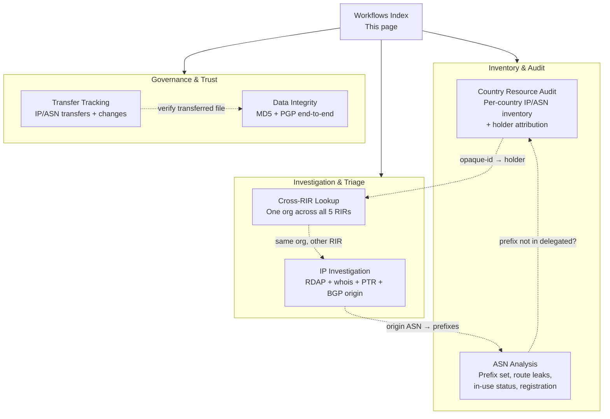
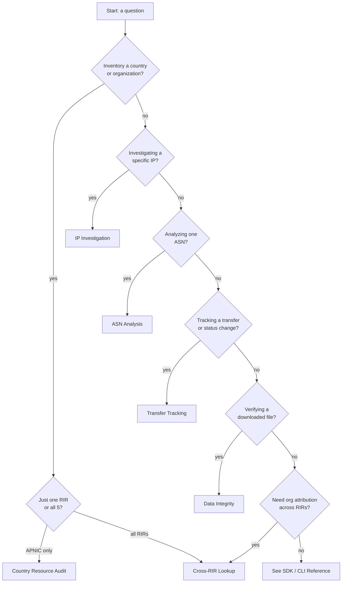
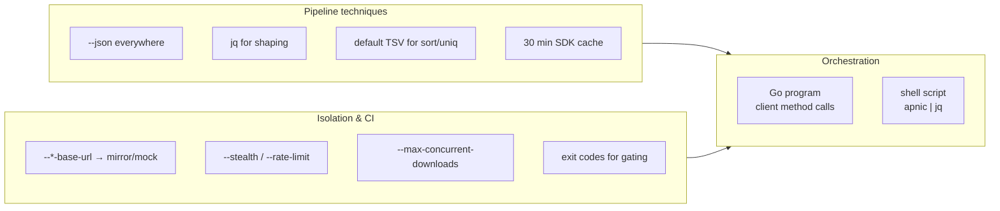

# Workflows

The `apnic-skills` SDK and the `apnic` CLI are designed to be composed. No single endpoint answers a real operational or audit question on its own; a country resource audit touches delegated + extended stats, an IP investigation fans out to RDAP + whois + reverse DNS + BGP, and integrity verification chains a data file through its MD5 sidecar and PGP signature. This section collects those end-to-end recipes.

Each workflow page follows the same structure:

1. **Scenario** — the real-world question being answered.
2. **Composition** — the SDK methods and CLI subcommands that combine to answer it, and why.
3. **Flow diagram** — a mermaid chart of the data movement.
4. **Go example** — a runnable SDK program.
5. **CLI combination** — copy-pasteable shell commands, piped through `jq` where useful.



## When to use which workflow



## Workflow map

| Workflow | Question answered | Primary data sources |
|----------|-------------------|----------------------|
| [Country Resource Audit](country-audit.md) | What IP/ASN resources does country X hold in APNIC, and which organizations hold them? | delegated, extended stats |
| [IP Investigation](ip-investigation.md) | Full picture of one IP: registration, whois, reverse DNS, origin ASN. | RDAP, whois, reverse DNS, thyme BGP |
| [ASN Analysis](asn-analysis.md) | What does one ASN announce, are any prefixes leaks, is it in use? | thyme BGP, RDAP, whois |
| [Transfer Tracking](transfer-tracking.md) | What IP/ASN moved between orgs or RIRs, and what changed? | transfers, transfers-all, changes |
| [Data Integrity](data-integrity.md) | Is a downloaded stats file authentic and unmodified? | verify (MD5 + PGP) |
| [Cross-RIR Lookup](cross-rir.md) | What does one organization hold across all five RIRs? | REx |

## Shared composition techniques

These apply to every workflow below; they are summarized once here rather than repeated on each page.



- **Everything emits `--json`.** Default output is human-readable TSV (pipe into `awk`/`sort`/`uniq -c`); `--json` gives the verbatim SDK return type for `jq`.
- **30-minute cache.** Repeated requests for the same source within a workflow hit the cache once. Disable with `--cache-ttl 0`; in the SDK use `WithCacheTTL(0)`.
- **Self-hosted mirrors.** `--stats-base-url`, `--rdap-base-url`, `--whois-server`, `--ftp-base-url`, `--rrdp-base-url`, `--thyme-base-url`, `--rex-base-url` all accept a mirror or local mock for CI and isolated tests.
- **Large-file download.** APNIC FTP throttles per connection (~8–22 KB/s). The SDK defaults to 4-way chunked Range download of ~2 MiB blocks; tune with `--max-concurrent-downloads`, `--chunk-size`, `--download-timeout`.
- **Anti-scraping.** `--stealth` (default on) sends Chrome headers + jitter + rate limit. For a polite identifiable bot: `--stealth=false --user-agent "my-bot/1.0 (contact: ...)"`. To throttle harder: `--rate-limit 1 --jitter 500ms-1500ms`.
- **Exit codes.** Use `set -e` or explicit `||` so a failed fetch gates the pipeline.

## Prerequisites

For the CLI examples, build the binary once:

```bash
go build -o bin/apnic ./cmd/apnic
# or substitute `go run ./cmd/apnic` for `apnic` below
```

For the Go examples:

```bash
go get github.com/cyberspacesec/apnic-skills
```

All Go examples assume this preamble unless noted:

```go
package main

import (
    "context"
    "log"

    apnic "github.com/cyberspacesec/apnic-skills"
)

func main() {
    client := apnic.NewClient()
    ctx := context.Background()
    _ = client
    _ = ctx
}
```
