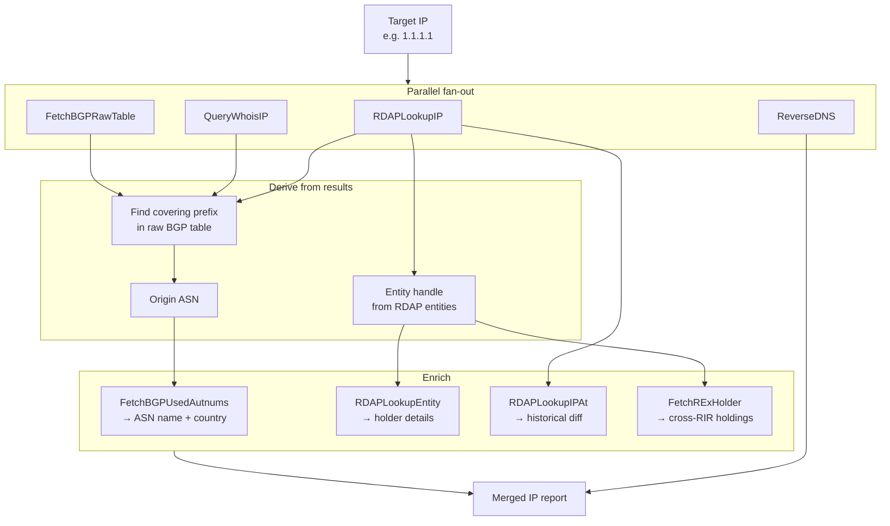
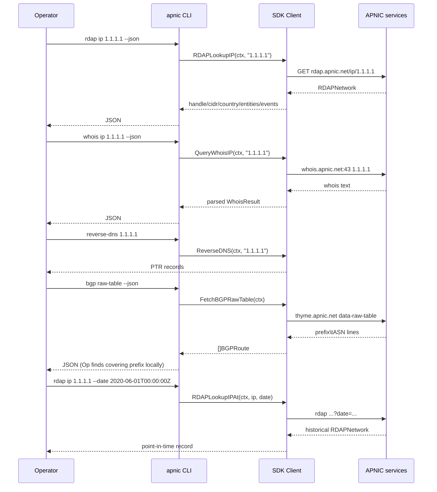

# IP Investigation

## Scenario

Given a single IP address (e.g. `1.1.1.1`), assemble its complete picture: which network it belongs to, the registered CIDR and country, the holding entity, registration and last-modified timestamps, the PTR record, and the origin ASN that announces it on the BGP table. Optionally compare today's registration against a point-in-time historical snapshot to detect reassignment.

## Composition

| Layer | Method / Command | Purpose |
|-------|------------------|---------|
| Registration | `RDAPLookupIP` / `apnic rdap ip` | Structured network record: handle, CIDR, country, type, entities, events. |
| Point-in-time | `RDAPLookupIPAt(ctx, ip, date)` / `--date` | The same record at a past UTC instant. |
| Whois detail | `QueryWhoisIP` / `apnic whois ip` | Parsed Network/CIDR/Country/OrgName/Parent/Created/LastUpdated. |
| Reverse DNS | `ReverseDNS` / `apnic reverse-dns` | PTR record(s). |
| Origin ASN | `FetchBGPRawTable` + local prefix match / `apnic bgp raw-table` | Which ASN announces the covering prefix. |
| Origin enrichment | `FetchBGPUsedAutnums` / `apnic bgp used-autnums` | Registered name + country for the origin ASN. |
| Holder drill-down | `RDAPLookupEntity(ctx, handle)` / `apnic rdap entity` | The entity handle returned by RDAP. |
| Cross-RIR | `FetchRExHolder` / `apnic rex holder` | Same organization's resources in other RIRs. |



## Flow: investigation sequence



## Go example

```go
package main

import (
    "context"
    "encoding/json"
    "fmt"
    "log"
    "net"
    "strings"

    apnic "github.com/cyberspacesec/apnic-skills"
)

// IPReport is the merged picture of one IP.
type IPReport struct {
    IP       string
    RDAP     *apnic.RDAPNetwork
    Whois    *apnic.WhoisResult
    PTR      []string
    OriginAS string
    ASNName  string
    ASNCountry string
}

// InvestigateIP builds a full report for one IP.
func InvestigateIP(ctx context.Context, client *apnic.Client, ip string) (*IPReport, error) {
    r := &IPReport{IP: ip}

    // 1. RDAP registration.
    netw, err := client.RDAPLookupIP(ctx, ip)
    if err == nil {
        r.RDAP = netw
    }

    // 2. Whois detail (parsed).
    if wr, err := client.QueryWhoisIP(ctx, ip); err == nil {
        r.Whois = wr
    }

    // 3. Reverse DNS.
    if names, err := client.ReverseDNS(ctx, ip); err == nil {
        r.PTR = names
    }

    // 4. Origin ASN: fetch the raw BGP table and find the covering prefix.
    routes, err := client.FetchBGPRawTable(ctx)
    if err == nil {
        r.OriginAS = findOriginASN(routes, ip)
    }

    // 5. Enrich the origin ASN with its registered name + country.
    if r.OriginAS != "" {
        if used, err := client.FetchBGPUsedAutnums(ctx, ""); err == nil {
            for _, u := range used {
                if u.ASN == r.OriginAS {
                    r.ASNName = u.Name
                    r.ASNCountry = u.Country
                    break
                }
            }
        }
    }

    return r, nil
}

// findOriginASN returns the ASN whose announced prefix contains ip.
func findOriginASN(routes []apnic.BGPRoute, ip string) string {
    parsed := net.ParseIP(ip)
    if parsed == nil {
        return ""
    }
    var best *apnic.BGPRoute
    bestOnes := -1
    for i := range routes {
        _, cidr, err := net.ParseCIDR(routes[i].Prefix)
        if err != nil {
            continue
        }
        if cidr.Contains(parsed) {
            ones, _ := cidr.Mask.Size()
            if ones > bestOnes {
                bestOnes = ones
                best = &routes[i]
            }
        }
    }
    if best == nil {
        return ""
    }
    return strings.TrimPrefix(best.ASN, "AS")
}

func main() {
    client := apnic.NewClient()
    ctx := context.Background()
    report, err := InvestigateIP(ctx, client, "1.1.1.1")
    if err != nil {
        log.Fatal(err)
    }
    b, _ := json.MarshalIndent(report, "", "  ")
    fmt.Println(string(b))
}
```

## CLI combination

```bash
IP=1.1.1.1

# 1) RDAP: network, CIDR, country, holding entity, events
apnic rdap ip "$IP" --json

# 2) Whois: parsed Network/CIDR/Country/OrgName/Parent/Created/LastUpdated
apnic whois ip "$IP" --json

# 3) Reverse DNS: PTR record(s)
apnic reverse-dns "$IP"

# 4) Origin ASN: find the announcing prefix in the raw BGP table
apnic --json bgp raw-table \
  | jq -r --arg ip "$IP" '
      .Routes[]
      | select(.Prefix as $p | $p | endswith("/24"))
      | "\(.Prefix)\t\(.ASN)"
    ' \
  | awk -v ip="$IP" 'BEGIN{
        # crude covering-prefix match: assumes /24 for brevity;
        # for full coverage pipe through a CIDR-aware tool (e.g. python ipaddress).
    }'

# 5) Origin ASN enrichment: registered name + country
apnic --json bgp used-autnums | jq -r --arg asn "13335" '.Autnums[] | select(.ASN==$asn)'

# 6) Drill into the holding entity handle returned by RDAP (e.g. AIC3-AP)
apnic rdap entity AIC3-AP --json

# 7) Point-in-time historical registration
apnic rdap ip "$IP" --date 2020-06-01T00:00:00Z --json
```

> The covering-prefix step above is illustrative; in practice use a CIDR-aware matcher. The Go example shows the canonical approach (`net.ParseCIDR` + longest-prefix match).

## One-shot script: merged JSON report

```bash
#!/usr/bin/env bash
# ip-report.sh — merge RDAP + whois + PTR into one JSON object.
set -euo pipefail
IP="${1:?usage: $0 <ip>}"

jq -n --arg ip "$IP" \
  --argjson rdap  "$(apnic rdap ip "$IP" --json)" \
  --argjson whois "$(apnic whois ip "$IP" --json)" \
  --argjson ptr   "$(apnic reverse-dns "$IP" --json)" \
  '{ip:$ip, rdap:$rdap, whois:$whois, ptr:$ptr}'
```

## Cross-RIR extension

APNIC RDAP only covers the APNIC region. If the holding entity also has resources in other RIRs, use REx to aggregate them:

```bash
# Self-locate the caller's covering network (prefix/ASN/economy)
apnic rex network

# Recent cross-RIR delegations with holder attribution
apnic rex resources ipv4 --json \
  | jq -r --arg ip "$IP" '... locate opaqueId + rir ...'

# Aggregate that org's holdings in the responsible RIR
apnic rex holder <opaqueId> <rir> --json
```

See the [Cross-RIR Lookup](cross-rir.md) workflow for the full recipe.

## Expected output

- **RDAP JSON:** `handle`, `cidr0_cidrs`, `country`, `type`, `entities` (holder handles such as `AIC3-AP`), `events` (registration / last-changed timestamps).
- **Whois JSON:** `Network`, `CIDR`, `Country`, `OrgName`, `Parent`, `Created`, `LastUpdated`.
- **Reverse DNS:** PTR domain name(s), or `(no PTR records)`.
- **Origin ASN:** the AS number announcing the covering prefix, plus its registered name and country from `used-autnums`.

## Notes

- RDAP, whois, reverse DNS, and the BGP raw table are independent — fetch them concurrently in the SDK to cut wall time.
- `FetchBGPRawTable` returns the full thyme raw table (every announced route). For a single IP you only need the covering prefix; if you investigate many IPs in one run, fetch the raw table once (it is cached) and match locally.
- `RDAPLookupIPAt` is point-in-time: pass an RFC3339 UTC instant. Use it to detect whether an IP was reassigned between two dates.
- The entity handle from RDAP is the bridge to `RDAPLookupEntity` and to REx's `opaqueId`.
