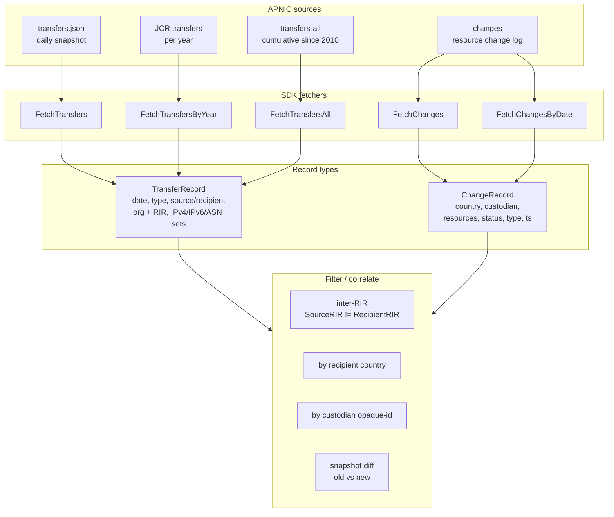
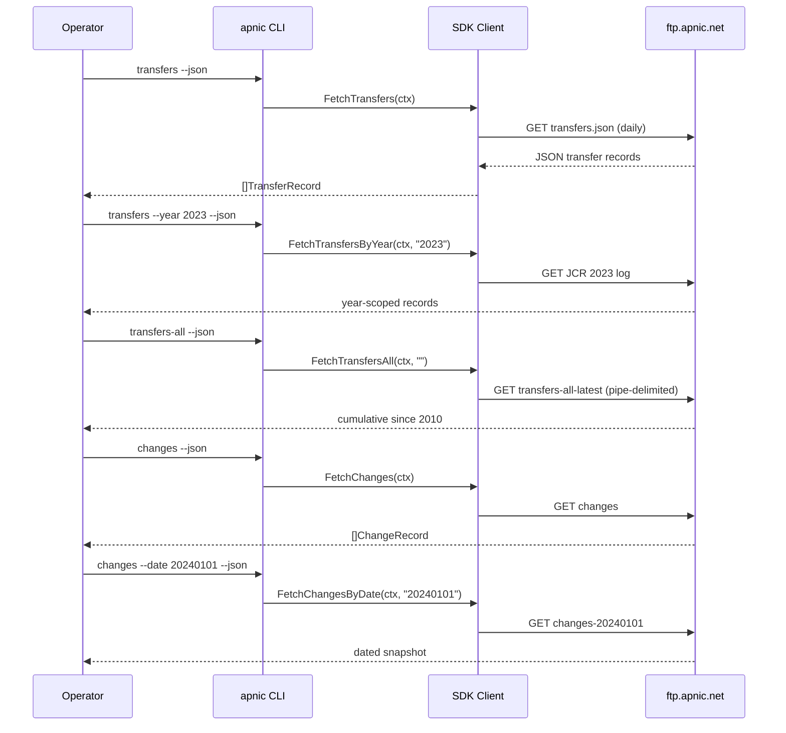

# Transfer Tracking

## Scenario

A transfer of IP or ASN resources between organizations (or between RIRs) is recorded by APNIC. An auditor needs to track these movements: which networks moved, when, from whom, to whom, and whether the move was intra-APNIC or inter-RIR. Layered on top, the `changes` feed records day-to-day status changes (allocations, assignments, custodian changes) that often accompany a transfer. The deliverable is a chronological, filterable history of resource movement.

## Composition

| Layer | Method / Command | Purpose |
|-------|------------------|---------|
| Latest transfers | `FetchTransfers` / `apnic transfers` | The daily JSON snapshot of transfer records. |
| By year | `FetchTransfersByYear(ctx, year)` / `--year` | JCR transfer log for one year. |
| Cumulative | `FetchTransfersAll(ctx, date)` / `apnic transfers-all` | All transfers since 2010 (pipe-delimited); `date=""` for latest, `YYYYMMDD` for an archive. |
| Cumulative integrity | `FetchTransfersAllMD5`, `FetchTransfersAllASC` | MD5 + PGP signature for the cumulative file. |
| Changes | `FetchChanges` / `apnic changes` | Resource change records (custodian/status/type). |
| Changes by date | `FetchChangesByDate(ctx, date)` / `--date` | A specific date's change snapshot. |
| Holder context | `FetchExtendedEntries` / `apnic filter --source extended` | Resolve a custodian `opaque-id` to an organization. |



## Flow: tracking sequence



## Go example

```go
package main

import (
    "context"
    "fmt"
    "log"

    apnic "github.com/cyberspacesec/apnic-skills"
)

// TransferSummary is a flattened view of one transfer for reporting.
type TransferSummary struct {
    Date      string
    Type      string
    From      string
    FromCC    string
    To        string
    ToCC      string
    InterRIR  bool
    IPv4Ranges []string
    IPv6Ranges []string
    ASNs      []string
}

// TrackTransfers fetches the latest transfers and flattens them.
func TrackTransfers(ctx context.Context, client *apnic.Client) ([]TransferSummary, error) {
    recs, err := client.FetchTransfers(ctx)
    if err != nil {
        return nil, err
    }
    out := make([]TransferSummary, 0, len(recs))
    for _, r := range recs {
        s := TransferSummary{
            Date: r.TransferDate.Format("2006-01-02"),
            Type: r.Type,
            From: r.SourceOrganization.Name,
            FromCC: r.SourceOrganization.CountryCode,
            To: r.RecipientOrganization.Name,
            ToCC: r.RecipientOrganization.CountryCode,
            InterRIR: r.SourceRIR != r.RecipientRIR,
        }
        if r.IPv4Nets != nil {
            for _, n := range r.IPv4Nets.TransferSet {
                s.IPv4Ranges = append(s.IPv4Ranges, n.StartAddress+"-"+n.EndAddress)
            }
        }
        if r.IPv6Nets != nil {
            for _, n := range r.IPv6Nets.TransferSet {
                s.IPv6Ranges = append(s.IPv6Ranges, n.StartAddress+"-"+n.EndAddress)
            }
        }
        if r.ASNs != nil {
            for _, a := range r.ASNs.TransferSet {
                s.ASNs = append(s.ASNs, fmt.Sprintf("%d-%d", a.StartASN, a.EndASN))
            }
        }
        out = append(out, s)
    }
    return out, nil
}

// RecentChanges returns the latest resource change records.
func RecentChanges(ctx context.Context, client *apnic.Client) ([]apnic.ChangeRecord, error) {
    return client.FetchChanges(ctx)
}

func main() {
    client := apnic.NewClient()
    ctx := context.Background()

    transfers, err := TrackTransfers(ctx, client)
    if err != nil {
        log.Fatal(err)
    }
    for _, t := range transfers {
        flag := ""
        if t.InterRIR {
            flag = " [INTER-RIR]"
        }
        fmt.Printf("%s %s: %s (%s) → %s (%s)%s\n",
            t.Date, t.Type, t.From, t.FromCC, t.To, t.ToCC, flag)
    }

    changes, err := RecentChanges(ctx, client)
    if err != nil {
        log.Fatal(err)
    }
    fmt.Printf("--- %d recent changes ---\n", len(changes))
    for _, c := range changes {
        fmt.Printf("%s %s custodian=%s country=%s resources=%v\n",
            c.Timestamp.Format("2006-01-02"), c.Type, c.Custodian, c.Country, c.Resources)
    }
}
```

## CLI combination

```bash
# 1) Latest transfers, flattened to the essential fields
apnic transfers --json | jq '.Transfers[] | {
  date: .transfer_date,
  type,
  from: .source_organization.name,
  from_cc: .source_organization.country_code,
  to: .recipient_organization.name,
  to_cc: .recipient_organization.country_code,
  ip4: .ip4nets,
  ip6: .ip6nets,
  asn: .asns
}'

# 2) One year of JCR transfer records
apnic transfers --year 2023 --json

# 3) Cumulative transfers since 2010 (latest), with date archive support
apnic transfers-all
apnic transfers-all --date 20220904

# 4) Latest resource changes (JSON Lines for streaming)
apnic changes --json | jq -c '.Changes[] | {cc, custodian, resources, status, type, timestamp}'

# 5) Changes for a specific date
apnic changes --date 20240101 --json
```

### Variant: only inter-RIR transfers

```bash
apnic transfers --json \
  | jq '.Transfers[] | select(.source_rir != .recipient_rir)'
```

### Variant: transfers into one country

```bash
apnic transfers --json \
  | jq '.Transfers[] | select(.recipient_organization.country_code == "CN")'
```

### Variant: monitor one custodian's changes

```bash
apnic changes --json \
  | jq -c '.Changes[] | select(.custodian == "A92E1062")'
```

## One-shot script: recently transferred IPv4 ranges

```bash
#!/usr/bin/env bash
# recent-ipv4-transfers.sh — unique IPv4 ranges from the latest transfer snapshot.
set -euo pipefail
apnic transfers --json | jq -r '
  .Transfers[]
  | select(.ip4nets != null)
  | .ip4nets.transfer_set[]
  | "\(.start_address) - \(.end_address)"
' | sort -u
```

## Expected output

- **Transfers:** each record carries `transfer_date`, `type` (`RESOURCE_TRANSFER` / `INTER_RIR_TRANSFER`), source/recipient organization name + country code, source/recipient RIR, and the transferred IPv4/IPv6/ASN sets.
- **Changes:** each record carries `cc`, `custodian` (opaque-id), `resources` (CIDR/ASN list), `status`, `type` (`delegated` / `cc-changed` / `status-changed`), and a `timestamp`.
- **transfers-all:** the cumulative pipe-delimited record set since 2010; use an archived `--date` for point-in-time cumulative state.

## Notes

- `FetchTransfers` returns the **daily** JSON snapshot; `FetchTransfersAll` returns the **cumulative** pipe-delimited file since 2010. They answer different questions: "what moved recently" vs "everything that has ever moved."
- The cumulative file has its own MD5 sidecar and PGP signature (`FetchTransfersAllMD5`, `FetchTransfersAllASC`) — verify them with the [Data Integrity](data-integrity.md) workflow before trusting a downloaded archive.
- A transfer and its accompanying changes often share a custodian/opaque-id; join on the opaque-id (from extended stats) to tie a `ChangeRecord.custodian` to an organization name.
- Inter-RIR transfers (`SourceRIR != RecipientRIR`) are the cross-boundary events most worth flagging; for the full cross-RIR picture of one organization, see the [Cross-RIR Lookup](cross-rir.md) workflow.
